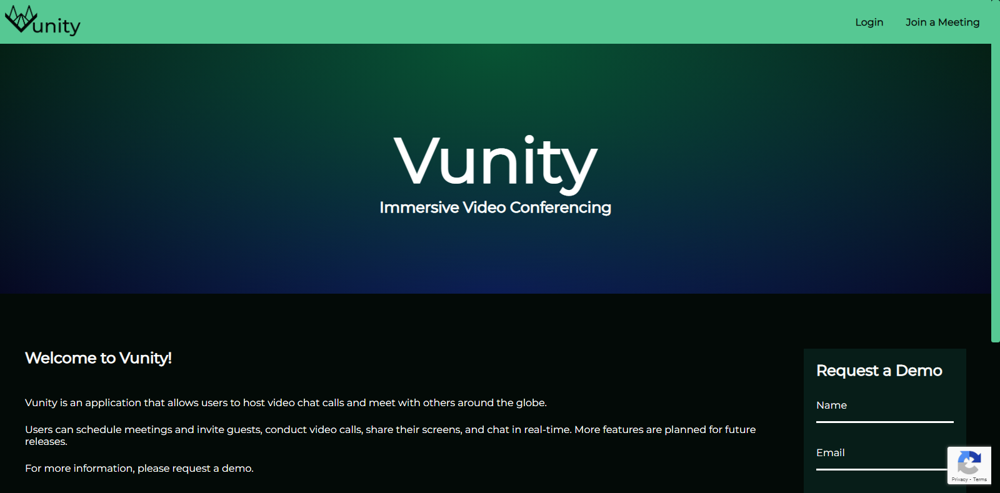
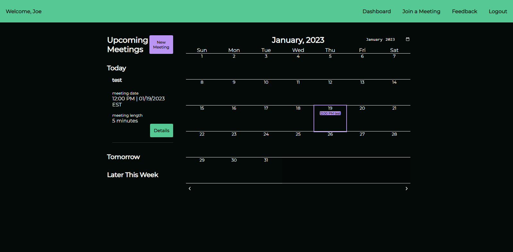
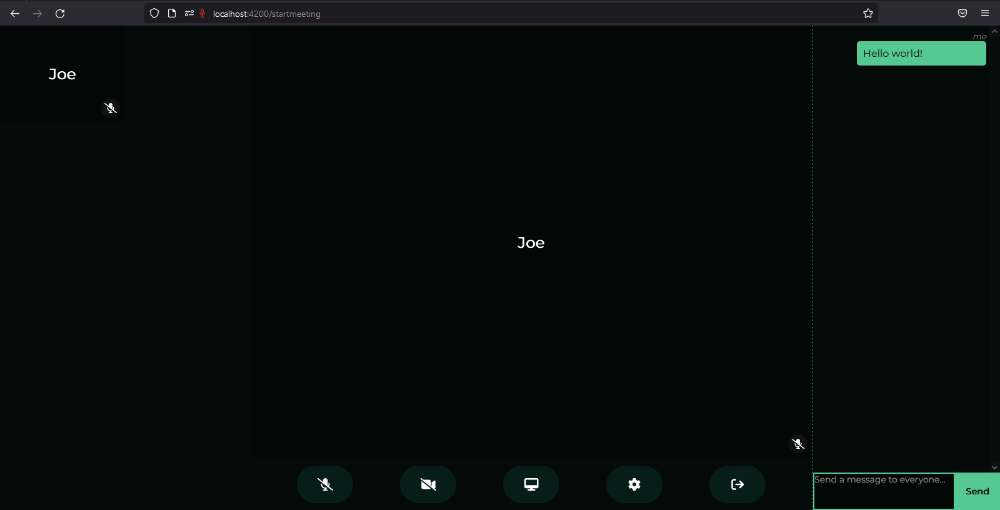

# Vunity

Vunity is a video chat application built with Spring Boot & Angular in conjunction with the WebRTC API. Vunity allows users to host real-time video chat calls. Within a meeting, users can video chat in real time, talk over a text message channel, and share their screen. Outside of an active meeting, Vunity allows users to create, edit, and delete meetings, view upcoming meetings, view a calendar of all scheduled meetings and invite guests to meetings.

Please visit https://vunity.link for the currently deployed site.

## Backend
The API was created with Spring Boot with a MySQL database.

## UI/UX
The application features a responsive UI designed by myself in Figma. Styling has been accomplished with SCSS. User experience research is also part of the process: user feedback is being collected via a link on users' dashboards.

## Scheduling Meetings

Users can schedule meetings via the upcoming meetings component, the calendar component, or the new meeting page (mobile only). Users can add guests' email addresses to the meeting at the time of its creation, and guests will be emailed a join link and passcode. Scheduled meetings will appear on the user's calendar while logged in.

## Hosting & Joining Meetings
While logged in, users can open their meetings as the host. Until a meeting is opened by a host, guests will be admitted to a waiting room. Hosts can end meetings for all guests. In order to join a meeting as a guest, guests must visit the join a meeting page and input the meeting id and passcode.

## Signaling/STUN & TURN
Vunity utilizies a websocket connection for signaling in order to establish a peer-to-peer connection via the WebRTC API. STUN and TURN servers are provided by [Open Relay Project.](https://openrelayproject.org/)

## Meeting Features
User's media streams are shared with each other via the WebRTC API. Users can mute their microphones and toggle their camera. The peers' data channels are used to allow for real-time text-based chat. One user at a time can share their screen. [Hark](https://github.com/otalk/hark) is used to detect speech events and notify the user when their peers are speaking (by highlighting their thumbnail and setting the large, central peer camera view to that peer's media stream).

## Authentication/Security
Authentication and authorization are built using Spring Security. JWT access & refresh tokens are stored as cookies, CSRF protection is set up as well. Rate-limiting is coded using Bucket4J and in production cookies are secure and same-site only. Passwords are hashed prior to storage. Google Recaptcha V3 is used to prevent bots from making calls to the API.

## Testing
Testing the backend has been accomplished with JUnit and the Spring TestContext Framework. The frontend is tested with Jasmine. Github actions has been used to automate tests everytime code is pushed to the main branch. Code coverage reports have been generated with OpenClover (backend) and Jasmine (frontend). Currently, more tests need to be written in order to bring the codebase up to 100% code coverage.

## CI/CD/Deployment
Github Actions has been used to automate testing upon each push to the main branch. Additionally, upon each release, a Docker image is built and pushed to AWS ECR. The application is currently deployed to AWS EC2.

## Future Visioning
Current goals can be broken down into six categories:

 - Finding and squashing bugs
 - Improving handling of client-side connection issues so that interruptions can be quickly and seamlessly recovered from
 - Refining current behavior and appearance
 - Continuing to clean up the codebase and tests so that the codebase adheres as much as possible to principles of clean code and remains maintainable and extensible
 - Preparing the application to scale
 - Adding additional features

### Improving Handling of Connection Interruptions
 - Currently, issues with the websocket connection need to be recovered from more gracefully. Currently, the server assumes that a severed websocket connection means that the user departed the meeting without sending a websocket message with the an intent field of "leave." This is to prevent zombie meetings remaining open even after all participants have left. Instead, there should be some kind of timeout in which an attempt is made to restore the websocket connection. Additionally, the speaking peer object needs to be released if that peer leaves.

### Preparing the Application for Scale
 - Redis caches should replace the ConcurrentHashMap used to store active meetings and the Guava Cache that is used to keep track of IP addresses for the purposes of rate-limiting. AWS ElastiCache could possibly be used to provide this. Externalizing the cache in this manner would enable the application to be provided by multiple instances instantiated on demand by a load balancer. 
 - Session storage/IndexedDB should be used to keep track of a user's meetings, etc, so that fewer calls need to be made to the server/db, keeping cloud fees at a minimum
 - The frontend and backend could be run in separate containers to allow for easier CI/CD and greater separation of concerns
 - CI/CD can be further automated

### Adding Additional Features
 - The app should be integrated with calendar applications such as Google Calendar
 - The app should allow other means of authentication (sign up with Google, etc)
 - Users should be able to send files during a meeting
 - Users should be able to select their camera and microphone from meeting settings
 - And many more
